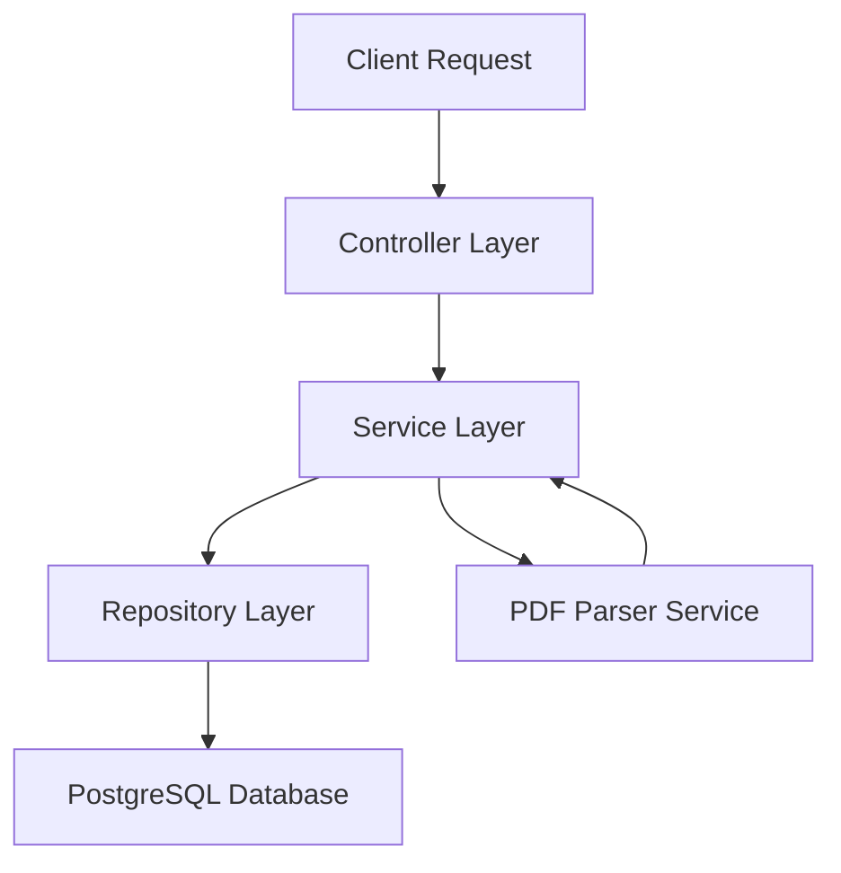

## System Architecture

WalletSync is built using **Spring Boot** and follows a clean layered architecture pattern that separates concerns and promotes maintainability. The application processes bank statements (PDFs) and automatically categorizes financial transactions.

<CardGroup cols={2}>
  <Card title="Controller Layer" icon="route">
    REST API endpoints handling HTTP requests and responses
  </Card>
  <Card title="Service Layer" icon="gear">
    Business logic and transaction processing
  </Card>
  <Card title="Repository Layer" icon="database">
    Data persistence using Spring Data JPA
  </Card>
  <Card title="PDF Processing" icon="file-pdf">
    Apache PDFBox for statement parsing
  </Card>
</CardGroup>

## Layered Architecture

WalletSync implements the classic **MVC (Model-View-Controller)** pattern with a service layer:



### Controller Layer

Controllers expose REST endpoints and delegate business logic to services. They handle:
- Request validation
- HTTP status codes
- Response formatting

<CodeGroup>
```java CategoryController.java
@RestController
@RequestMapping("/api/categories")
@RequiredArgsConstructor
public class CategoryController {

    private final CategoryService categoryService;

    @GetMapping
    public ResponseEntity<List<CategoryDTO>> getAll() {
        return ResponseEntity.ok(categoryService.findAll());
    }

    @PostMapping
    public ResponseEntity<CategoryDTO> create(@RequestBody CategoryDTO categoryDTO) {
        CategoryDTO savedCategory = categoryService.save(categoryDTO);
        return new ResponseEntity<>(savedCategory, HttpStatus.CREATED);
    }
}
```

```java SantanderPaymentMovementController.java
@RestController
@RequestMapping("/api/payments/santander")
@RequiredArgsConstructor
public class SantanderPaymentMovementController {

    private final BankMovementService<SantanderPaymentMovementDTO> santanderPaymentMovementService;
    private final AssociationProcessorService associationProcessorService;

    @Override
    public ResponseEntity<List<AssociatedSantanderPaymentDTO>> getAllMovementsWithCategories() {
        List<SantanderPaymentMovementDTO> movements = santanderPaymentMovementService.findAll();
        List<AssociatedSantanderPaymentDTO> result = associationProcessorService.process(movements);
        return ResponseEntity.ok(result);
    }
}
```
</CodeGroup>

<Note>
  Controllers are kept thin and delegate all business logic to the service layer.
</Note>

### Service Layer

The service layer contains business logic and orchestrates operations:

- **CategoryService**: Manages expense and income categories
- **SantanderPaymentMovementService**: Handles payment movement CRUD operations
- **MovementCategoryAssociationService**: Manages categorization rules
- **AssociationProcessorService**: Implements automated categorization logic
- **PdfParserService**: Extracts transaction data from PDF statements

```java CategoryService.java
@Service
@RequiredArgsConstructor
public class CategoryService {

    private final CategoryRepository categoryRepository;

    public List<CategoryDTO> findAll() {
        return categoryRepository.findAll().stream()
                .map(this::convertToDTO)
                .collect(Collectors.toList());
    }

    @Transactional
    public CategoryDTO save(CategoryDTO dto) {
        Category category = new Category();
        category.setCategoryName(dto.getCategoryName());
        category.setCategoryType(CategoryType.valueOf(dto.getCategoryType()));
        return convertToDTO(categoryRepository.save(category));
    }
}
```

<Tip>
  Services are annotated with `@Transactional` to ensure database consistency.
</Tip>

### Repository Layer

WalletSync uses **Spring Data JPA** repositories for database access. Repositories extend `JpaRepository`, which provides:

- Standard CRUD operations
- Query derivation from method names
- Custom query support with `@Query`

```java CategoryRepository.java
@Repository
public interface CategoryRepository extends JpaRepository<Category, Long> {
    // JpaRepository provides: findAll(), findById(), save(), deleteById(), etc.
}
```

```java SantanderPaymentMovementRepository.java
@Repository
public interface SantanderPaymentMovementRepository extends JpaRepository<SantanderPaymentMovement, Long> {
}
```

## PDF Processing with Apache PDFBox

One of WalletSync's core features is parsing bank statement PDFs. The `PdfParserService` uses **Apache PDFBox** to extract transaction data:

```java PdfParserService.java
@Service
@Slf4j
public class PdfParserService {

    private static final DateTimeFormatter DATE_FORMATTER = DateTimeFormatter.ofPattern("dd/MM/yyyy");
    private static final Pattern DATE_PATTERN = Pattern.compile("^(0[1-9]|[12][0-9]|3[01])/(0[1-9]|1[0-2])/\\d{4}");
    private static final Pattern AMOUNT_PATTERN = Pattern.compile("(-?\\d+(?:\\.\\d{3})*,\\d{2})$");

    public List<SantanderPaymentMovementDTO> extractMovements(MultipartFile file) throws IOException {
        log.info("Iniciando el procesamiento del archivo PDF: {}", file.getOriginalFilename());

        List<SantanderPaymentMovementDTO> movements = new ArrayList<>();
        
        try (PDDocument document = Loader.loadPDF(file.getBytes())) {
            PDFTextStripper stripper = new PDFTextStripper();
            String text = stripper.getText(document);
            String[] lines = text.split("\\r?\\n");

            // Extract dates, labels, amounts using regex patterns
            for (String line : lines) {
                String trimmedLine = line.trim();
                
                if (isDateFormat(trimmedLine)) {
                    operationDateList.add(LocalDate.parse(trimmedLine, DATE_FORMATTER));
                }
                
                if(trimmedLine.contains("Compra") || trimmedLine.contains("Bizum")){
                    operationLabelList.add(trimmedLine);
                }
            }
        }
        
        return movements;
    }
}
```

<Steps>
  <Step title="Upload PDF">
    User uploads a bank statement PDF via `/api/payments/santander/upload-pdf`
  </Step>
  <Step title="Extract Text">
    PDFBox extracts raw text from the PDF document
  </Step>
  <Step title="Parse Data">
    Regex patterns identify dates, descriptions, amounts, and balances
  </Step>
  <Step title="Create Entities">
    Parsed data is converted to `SantanderPaymentMovementDTO` objects
  </Step>
  <Step title="Persist">
    Movements are saved to PostgreSQL via repository layer
  </Step>
</Steps>

## Data Persistence with PostgreSQL

WalletSync uses **PostgreSQL** as its relational database with **JPA (Java Persistence API)** for object-relational mapping.

### Key Technologies

- **Spring Data JPA**: Simplifies database access
- **Hibernate**: JPA implementation (ORM)
- **PostgreSQL**: Production-grade RDBMS
- **HikariCP**: High-performance connection pool

### Entity Management

Entities are POJOs annotated with JPA annotations:

```java
@Entity
@Table(name = "santander_payment_movements")
public class SantanderPaymentMovement {
    @Id
    @GeneratedValue(strategy = GenerationType.IDENTITY)
    private Long id;
    
    @Column(nullable = false)
    private LocalDate operationDate;
    
    @Column(precision = 19, scale = 4)
    private BigDecimal amount;
}
```

<Info>
  JPA automatically creates and manages database tables based on entity definitions.
</Info>

## Request Flow Example

Here's how a typical request flows through the architecture:

```
1. POST /api/payments/santander/upload-pdf
   ↓
2. SantanderFileUploadController receives MultipartFile
   ↓
3. PdfParserService.extractMovements(file)
   ↓
4. SantanderPaymentMovementService.saveList(movements)
   ↓
5. SantanderPaymentMovementRepository.saveAll(entities)
   ↓
6. PostgreSQL stores data
   ↓
7. Controller returns success response
```

## Dependency Injection

WalletSync uses **Spring's dependency injection** via constructor injection:

```java
@Service
@RequiredArgsConstructor  // Lombok generates constructor
public class CategoryService {
    private final CategoryRepository categoryRepository;
    // Spring automatically injects the repository
}
```

<Warning>
  Always use constructor injection (not field injection) for better testability and immutability.
</Warning>

## Next Steps

<CardGroup cols={2}>
  <Card title="Data Model" icon="database" href="/concepts/data-model">
    Explore entity relationships and JPA annotations
  </Card>
  <Card title="Categorization" icon="tags" href="/concepts/categorization">
    Learn how automated categorization works
  </Card>
</CardGroup>