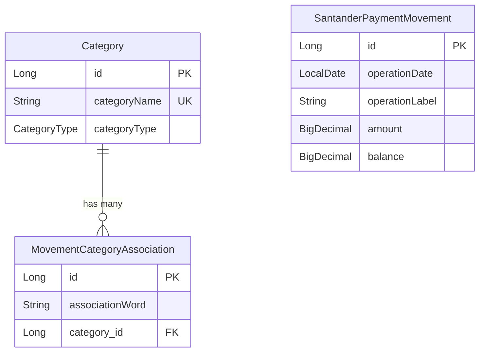

## Overview

WalletSync's data model consists of three core entities that work together to store and categorize financial transactions:

<CardGroup cols={3}>
  <Card title="Category" icon="tag">
    Expense and income classifications
  </Card>
  <Card title="SantanderPaymentMovement" icon="money-bill">
    Individual bank transactions
  </Card>
  <Card title="MovementCategoryAssociation" icon="link">
    Rules for automated categorization
  </Card>
</CardGroup>

## Entity Relationship Diagram



<Info>
  The relationship between `Category` and `MovementCategoryAssociation` is **one-to-many**: each category can have multiple association rules.
</Info>

## Category Entity

The `Category` entity represents financial classifications for both expenses and incomes.

```java Category.java
package com.mymoney.walletsync.model.common.entity;

import com.mymoney.walletsync.model.common.enums.CategoryType;
import jakarta.persistence.*;
import lombok.*;

@Entity
@Getter
@Setter
@NoArgsConstructor
@AllArgsConstructor
public class Category {

    @Id
    @GeneratedValue(strategy = GenerationType.IDENTITY)
    private Long id;

    @Column(unique = true, nullable = false)
    private String categoryName;

    @Enumerated(EnumType.STRING)
    private CategoryType categoryType;
}
```

### JPA Annotations Explained

<AccordionGroup>
  <Accordion title="@Entity">
    Marks this class as a JPA entity, meaning it will be mapped to a database table named `category`.
  </Accordion>
  
  <Accordion title="@Id and @GeneratedValue">
    `@Id` designates the primary key field. `@GeneratedValue(strategy = GenerationType.IDENTITY)` tells JPA to use the database's auto-increment feature for generating IDs.
  </Accordion>
  
  <Accordion title="@Column(unique = true, nullable = false)">
    Enforces a unique constraint on `categoryName` at the database level and prevents null values.
  </Accordion>
  
  <Accordion title="@Enumerated(EnumType.STRING)">
    Stores the enum value as a string ("EXPENSE" or "INCOME") rather than an integer ordinal.
  </Accordion>
</AccordionGroup>

### CategoryType Enum

```java CategoryType.java
package com.mymoney.walletsync.model.common.enums;

public enum CategoryType {
    EXPENSE,
    INCOME
}
```

### Example Categories

<CodeGroup>
```json Expense Categories
[
  { "id": 1, "categoryName": "GROCERIES", "categoryType": "EXPENSE" },
  { "id": 2, "categoryName": "TRANSPORT", "categoryType": "EXPENSE" },
  { "id": 3, "categoryName": "UTILITIES", "categoryType": "EXPENSE" },
  { "id": 4, "categoryName": "OTHERS_EXPENSES", "categoryType": "EXPENSE" }
]
```

```json Income Categories
[
  { "id": 5, "categoryName": "SALARY", "categoryType": "INCOME" },
  { "id": 6, "categoryName": "FREELANCE", "categoryType": "INCOME" },
  { "id": 7, "categoryName": "OTHERS_INCOMES", "categoryType": "INCOME" }
]
```
</CodeGroup>

<Tip>
  `OTHERS_EXPENSES` and `OTHERS_INCOMES` are special categories automatically created for transactions that don't match any association rules.
</Tip>

## SantanderPaymentMovement Entity

This entity stores individual bank transactions extracted from Santander PDF statements.

```java SantanderPaymentMovement.java
package com.mymoney.walletsync.model.santander.entity;

import jakarta.persistence.*;
import lombok.*;

import java.math.BigDecimal;
import java.time.LocalDate;

@Entity
@Table(name = "santander_payment_movements")
@Getter
@Setter
@NoArgsConstructor
@AllArgsConstructor
public class SantanderPaymentMovement {

    @Id
    @GeneratedValue(strategy = GenerationType.IDENTITY)
    private Long id;

    @Column(nullable = false)
    private LocalDate operationDate;

    private String operationLabel;

    @Column(precision = 19, scale = 4)
    private BigDecimal amount;

    @Column(precision = 19, scale = 4)
    private BigDecimal balance;
}
```

### Field Descriptions

| Field | Type | Description |
|-------|------|-------------|
| `id` | Long | Primary key, auto-generated |
| `operationDate` | LocalDate | Date of the transaction (not nullable) |
| `operationLabel` | String | Transaction description from bank statement |
| `amount` | BigDecimal | Transaction amount (negative for expenses, positive for income) |
| `balance` | BigDecimal | Account balance after the transaction |

### BigDecimal Precision

```java
@Column(precision = 19, scale = 4)
private BigDecimal amount;
```

<Info>
  **Precision = 19**: Total number of digits (both before and after decimal point)
  
  **Scale = 4**: Number of digits after the decimal point
  
  This allows values like `999,999,999,999,999.9999`
</Info>

<Warning>
  Always use `BigDecimal` for monetary values, never `float` or `double`, to avoid rounding errors.
</Warning>

### Example Transaction Records

```json
[
  {
    "id": 101,
    "operationDate": "2024-01-15",
    "operationLabel": "Compra en MERCADONA",
    "amount": -45.67,
    "balance": 1234.56
  },
  {
    "id": 102,
    "operationDate": "2024-01-16",
    "operationLabel": "Bizum recibido de Juan",
    "amount": 20.00,
    "balance": 1254.56
  },
  {
    "id": 103,
    "operationDate": "2024-01-17",
    "operationLabel": "Recibo LUZ Y GAS",
    "amount": -89.23,
    "balance": 1165.33
  }
]
```

## MovementCategoryAssociation Entity

This entity defines keyword-to-category mapping rules for automated categorization.

```java MovementCategoryAssociation.java
package com.mymoney.walletsync.model.common.entity;

import jakarta.persistence.*;
import lombok.*;

@Entity
@Getter
@Setter
@NoArgsConstructor
@AllArgsConstructor
public class MovementCategoryAssociation {

    @Id
    @GeneratedValue(strategy = GenerationType.IDENTITY)
    private Long id;

    private String associationWord;

    @ManyToOne(fetch = FetchType.LAZY)
    @JoinColumn(name = "category_id")
    private Category category;
}
```

### Relationship Annotations

<AccordionGroup>
  <Accordion title="@ManyToOne">
    Defines a many-to-one relationship: many associations can reference the same category.
  </Accordion>
  
  <Accordion title="fetch = FetchType.LAZY">
    The associated `Category` is not loaded from the database until explicitly accessed, improving performance.
  </Accordion>
  
  <Accordion title="@JoinColumn(name = 'category_id')">
    Specifies the foreign key column name in the database table.
  </Accordion>
</AccordionGroup>

### Association Rules Example

```json
[
  {
    "id": 1,
    "associationWord": "MERCADONA",
    "category": { "id": 1, "categoryName": "GROCERIES" }
  },
  {
    "id": 2,
    "associationWord": "CARREFOUR",
    "category": { "id": 1, "categoryName": "GROCERIES" }
  },
  {
    "id": 3,
    "associationWord": "UBER",
    "category": { "id": 2, "categoryName": "TRANSPORT" }
  },
  {
    "id": 4,
    "associationWord": "RECIBO LUZ",
    "category": { "id": 3, "categoryName": "UTILITIES" }
  }
]
```

<Note>
  Multiple association words can map to the same category (e.g., "MERCADONA" and "CARREFOUR" both map to "GROCERIES").
</Note>

## Database Schema

Here's what the generated PostgreSQL schema looks like:

```sql
CREATE TABLE category (
    id BIGSERIAL PRIMARY KEY,
    category_name VARCHAR(255) UNIQUE NOT NULL,
    category_type VARCHAR(50)
);

CREATE TABLE santander_payment_movements (
    id BIGSERIAL PRIMARY KEY,
    operation_date DATE NOT NULL,
    operation_label VARCHAR(255),
    amount NUMERIC(19, 4),
    balance NUMERIC(19, 4)
);

CREATE TABLE movement_category_association (
    id BIGSERIAL PRIMARY KEY,
    association_word VARCHAR(255),
    category_id BIGINT,
    FOREIGN KEY (category_id) REFERENCES category(id)
);
```

<Tip>
  JPA automatically generates these tables when `spring.jpa.hibernate.ddl-auto` is set to `update` or `create` in application properties.
</Tip>

## DTOs vs Entities

WalletSync uses **DTOs (Data Transfer Objects)** to decouple the API layer from the persistence layer:

- **Entities**: JPA-annotated classes mapped to database tables
- **DTOs**: Plain Java objects used for API requests/responses

```java
// Service layer converts between Entity and DTO
private CategoryDTO convertToDTO(Category category) {
    CategoryDTO dto = new CategoryDTO();
    dto.setId(category.getId());
    dto.setCategoryName(category.getCategoryName());
    dto.setCategoryType(category.getCategoryType().name());
    return dto;
}
```

<CardGroup cols={2}>
  <Card title="Benefits of DTOs" icon="circle-check">
    - Hide implementation details
    - Version API independently
    - Avoid Jackson serialization issues
    - Prevent lazy loading exceptions
  </Card>
  
  <Card title="Entity Best Practices" icon="shield-check">
    - Use Lombok annotations
    - Always use BigDecimal for money
    - Use LocalDate for dates
    - Apply proper JPA constraints
  </Card>
</CardGroup>

## Next Steps

<Card title="Categorization System" icon="robot" href="/concepts/categorization">
  Learn how WalletSync automatically categorizes transactions using these entities
</Card>